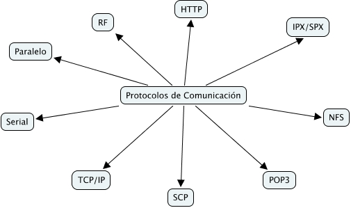

## Protocolos de Comunicación

Los protocolos de comunicación son estándares formales que están formados por
procedimientos, restricciones y formatos, que permiten el intercambio de un
conjunto de información, lo cual puede lograr la correcta comunicación entre
servidores o dispositivos a través de una red.

Para todo ello, los protocolos de comunicación incluyen ciertos mecanismos que
permiten que los dispositivos se identifiquen y establezcan conexiones entre sí.
También se incluyen normas que especifican cómo son los paquetes y los datos
en cada mensaje enviado y recibido.

En la actualidad, algunos protocolos de comunicación admiten el reconocimiento
de mensajes y la compresión de datos, lo cual permite una comunicación de red
muy confiable y con alto rendimiento.

