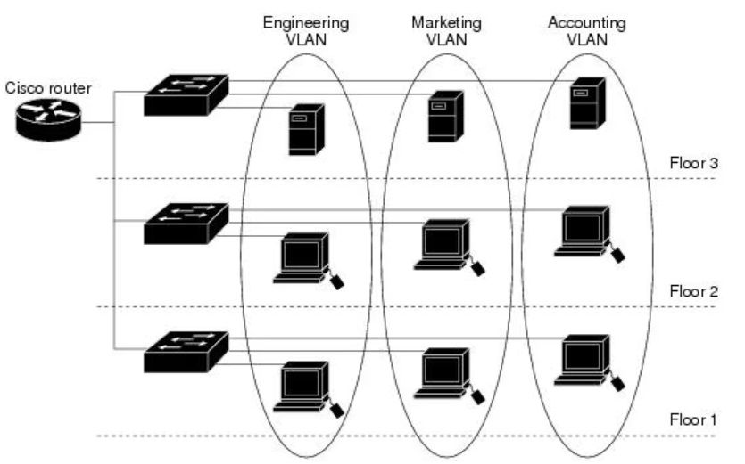

## VLAN (Virtual LAN)

Las **VLAN** (Virtual LAN), o también conocidas como redes de área local virtuales, es una tecnología de redes que nos permite una segmentación lógica en una red conmutada, permitiendo que grupos de dispositivos se comuniquen como si estuvieran conectados al mismo cable, independientemente del switch físico o la ubicación en una LAN del campus.

### Beneficios y Funcionalidad

Esto se traduce en una **flexibilidad organizativa**, ya que el administrador puede dividir la red en segmentos según la función, el proyecto o la aplicación, sin tener en cuenta la ubicación física del usuario o del dispositivo.

En una **VLAN**, los dispositivos comparten una misma infraestructura, pero se consideran parte de redes lógicas diferentes. Los paquetes de **unidifusión, difusión y multidifusión** se reenvían sólo a terminales dentro de la VLAN de origen. Esto mejora la **seguridad y eficiencia** de la red al evitar que dispositivos no pertenecientes a la VLAN reciban información no deseada.

### Mejoras en el Rendimiento

Además, las **VLAN** crean **dominios de difusión lógicos** que pueden abarcar varios segmentos LAN físicos, mejorando el rendimiento al dividir grandes dominios de difusión en otros más pequeños. 

Los administradores pueden implementar **políticas de acceso y seguridad específicas** para grupos de usuarios, simplificando la administración de la red.

