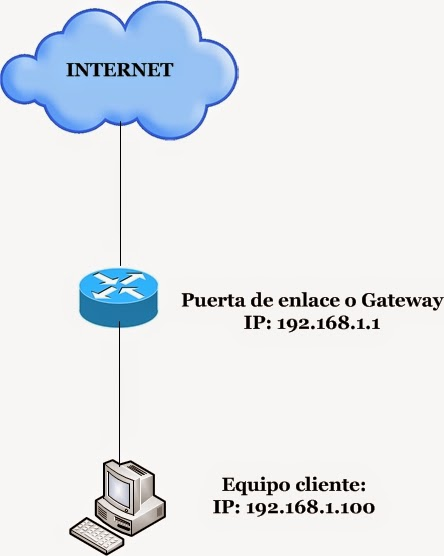

# Pregunta 19: ¿Qué es un Gateway?

Un **Gateway** (puerta de enlace) es un dispositivo o software que actúa como intermediario entre redes con diferentes protocolos o arquitecturas, permitiendo la comunicación entre ellas. Funciona como un "traductor" para conectar redes distintas (ej: una red local con Internet o una red IP con una red telefónica).

Previamente, gateways y routers eran dispositivos distintos. Pero hoy en día es común que ambas funcionalidades se encuentren en el mismo dispositivo.

