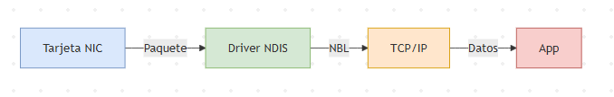

# Pregunta 20: Según Microsoft, ¿qué significa NBL?

Es una **estructura de datos** en el kernel de Windows que representa una lista de buffers (paquetes de red) que deben ser procesados por los componentes de red, como:  
- **Tarjetas de red (NICs)**.  
- **Controladores de red (NDIS drivers)**.  
- **Protocolos de red (TCP/IP stack)**.  

Funciona como un **contenedor eficiente** para agrupar múltiples paquetes de red (*frames*) y pasarlos entre las capas del sistema operativo.

---

## **Características clave**  
1. **Estructura enlazada**:  
   - Cada NBL contiene uno o más **NET_BUFFER** (estructuras que almacenan los datos crudos del paquete).  
   - Permite manejar múltiples paquetes en una sola operación (ej: enviar/recibir batches).  

2. **Uso en NDIS**:  
   - Parte de la **NDIS (*Network Driver Interface Specification*)**, la API de Microsoft para desarrollo de drivers de red.  
   - Los drivers usan NBL para transferir paquetes entre:  
     - **Modo usuario** (aplicaciones) ↔ **Modo kernel** (protocolos/drivers).  

3. **Optimización de rendimiento**:  
   - Reduce la sobrecarga al evitar copias innecesarias de datos.  
   - Soporte para **DMA (*Direct Memory Access*)**: Los NICs acceden directamente a los buffers.  

---

## **Ejemplo de flujo con NBL**  
1. Un paquete llega a la tarjeta de red.  
2. El driver de la NIC crea un **NET_BUFFER** con los datos y lo agrega a un **NBL**.  
3. El NBL se pasa al protocolo TCP/IP para su procesamiento.  
4. Finalmente, se entrega a la aplicación destino (ej: un servidor web).  

---

## **¿Por qué es importante?**  
- **Eficiencia**: Manejo de alto rendimiento en redes (crítico para servidores o tráfico intensivo).  
- **Flexibilidad**: Soporta diferentes tipos de tráfico (IPv4, IPv6, VLANs, etc.).  
- **Debugging**: Herramientas como **Wireshark** o **Network Monitor** usan NBL para capturar tráfico.  

