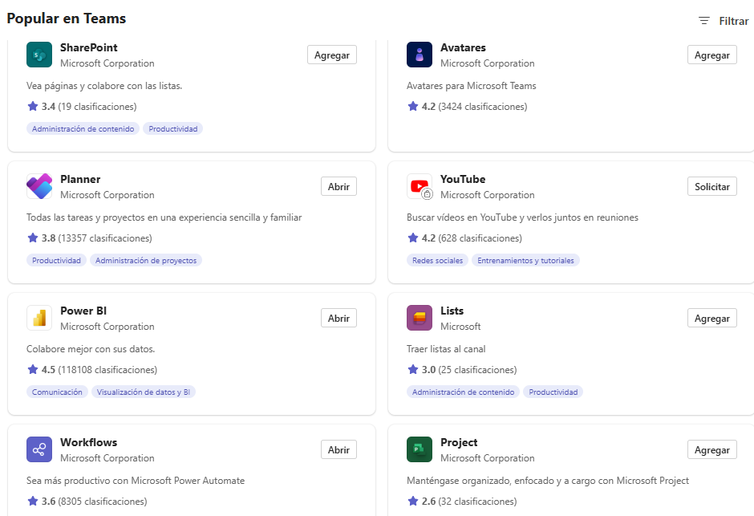

# Pregunta 23: Solución Microsoft Teams

**Microsoft Teams** es una plataforma de colaboración integral con:  
- **Chats**: Mensajería instantánea individual/grupal.  
- **Integración con Office 365**: Compartir archivos (Word, Excel) en tiempo real.  
- **Videoconferencias**: Con soporte para reuniones grandes (hasta 10,000 participantes) permitiendo grabar las llamadas y programando las reuniones en el calendario de Outlook.  
- **Canales temáticos**: Organización por proyectos o equipos.
- **Integración con aplicaciones**

