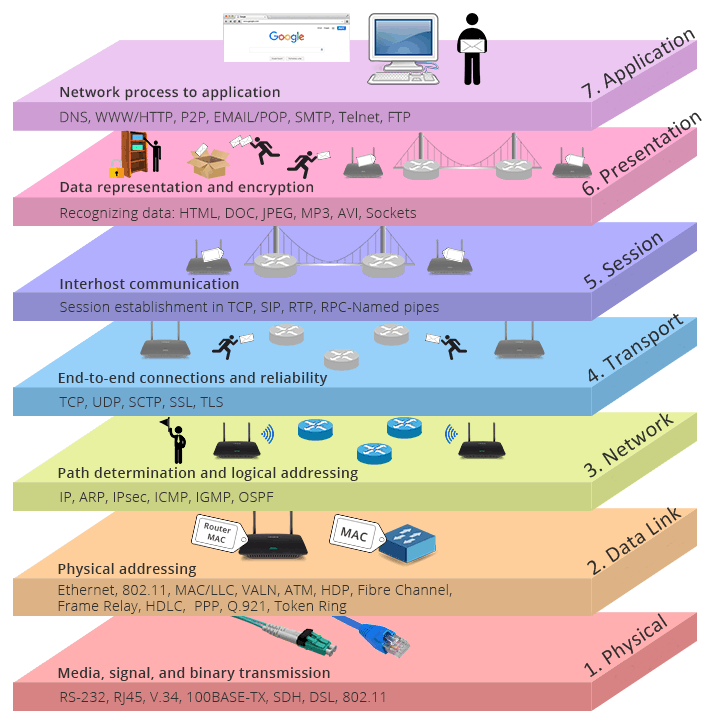

# Pregunta 27: Explique el Modelo OSI

El **Modelo OSI** (*Open Systems Interconnection* / Interconexión de Sistemas Abiertos) es un modelo conceptual de siete capas que caracteriza y estandariza las funciones de comunicación de un sistema de telecomunicaciones o informático.

## Capas del Modelo OSI:

1. **Capa Física (Capa 1)**:  
   Es la capa más baja del modelo OSI. Se encarga de la transmisión y recepción del flujo de bits sin estructura a través de un medio físico. Define las interfaces eléctricas/ópticas, mecánicas y funcionales con el medio físico, y transporta las señales para todas las capas superiores.

2. **Capa de Enlace de Datos (Capa 2)**:  
   Proporciona la transferencia sin errores de tramas de datos entre nodos a través de la capa física. Permite que las capas superiores asuman una transmisión prácticamente libre de errores sobre el enlace.

3. **Capa de Red (Capa 3)**:  
   Controla el funcionamiento de la subred. Decide la ruta física que deben seguir los datos en función de las condiciones de la red, prioridades de servicio y otros factores.

4. **Capa de Transporte (Capa 4)**:  
   Garantiza que los mensajes se entreguen sin errores, en secuencia, y sin pérdidas o duplicaciones.

5. **Capa de Sesión (Capa 5)**:  
   Permite establecer sesiones entre procesos que se ejecutan en diferentes estaciones.

6. **Capa de Presentación (Capa 6)**:  
   Formatea los datos para que sean presentados a la capa de aplicación. Actúa como "traductor" de la red: convierte los datos del formato usado por la capa de aplicación a un formato común en el equipo emisor, y viceversa en el receptor.

7. **Capa de Aplicación (Capa 7)**:  
   Sirve como ventana para que usuarios y procesos de aplicaciones accedan a los servicios de red.

## Diagrama del Modelo OSI:
  
*Figura 1: Capas del Modelo OSI.*