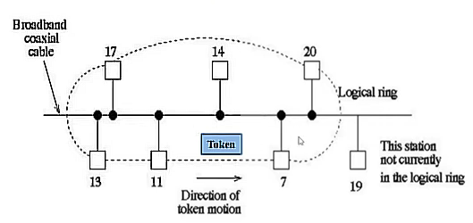

# Pregunta 30: Explicar el estándar IEEE 802.4 que regula la red.

## Definición
El estándar **IEEE 802.4** regula redes en **bus con paso de testigo** (*Token Bus*). 

## Características clave
- **Topología**: Bus lógico (aunque físicamente puede implementarse como estrella)
- **Mecanismo de acceso**: 
  - Uso de un **testigo** (*token*), una trama de control especial
  - El testigo otorga permiso temporal para transmitir

## Funcionamiento
1. **Secuencia de operación**:
   - El testigo circula entre las estaciones en un orden lógico
   - Una estación solo puede transmitir cuando posee el testigo
   - Al terminar su transmisión, pasa el testigo a la siguiente estación

     
   *Diagrama: Circulación del testigo en IEEE 802.4*

2. **Ventajas del sistema**:
   - Acceso determinístico (sin colisiones)
   - Prioridad predecible para cada estación
   - Adecuado para entornos industriales/tiempo real

3. **Limitaciones**:
   - Complejidad en la gestión del testigo
   - Menos eficiente en redes con poco tráfico
   - Poco utilizado en redes modernas

## Comparación con otros estándares
| Característica | IEEE 802.4 (Token Bus) | IEEE 802.3 (Ethernet) |
|---------------|-----------------------|----------------------|
| Acceso al medio | Paso de testigo | CSMA/CD |
| Topología | Bus lógico | Bus/Estrella |
| Uso típico | Entornos industriales | Redes generales |