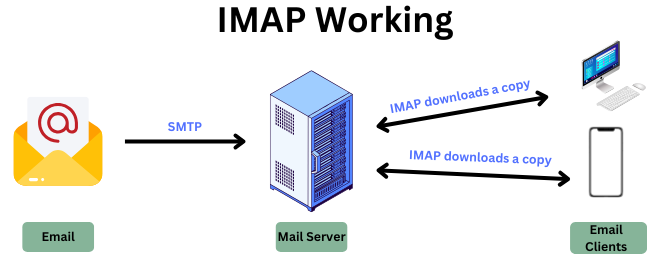

# Pregunta 31: ¿Qué protocolos se usan para enviar y recibir correo?

## 1. SMTP (Simple Mail Transfer Protocol)
  
**Descripción**:  
Protocolo estándar para el **envío** de correos electrónicos entre servidores. Opera en puerto 25 (no cifrado), 587 (con autenticación) o 465 (SSL/TLS).

**Proceso:**  
1. **Composición**: Creas el correo y haces clic en "Enviar".  
2. **Envío**: Tu cliente de correo se conecta al servidor SMTP y envía el email.  
3. **Enrutamiento**: El servidor SMTP identifica el servidor del destinatario usando el dominio (ej: "example.com" en "user@example.com").  
4. **Entrega**: El servidor SMTP reenvía el correo al servidor del destinatario.  
5. **Almacenamiento**: El servidor del destinatario guarda el correo hasta que sea leído.

---

## 2. POP3 (Post Office Protocol version 3)
  
**Descripción**:  
Protocolo para recuperar correos desde un servidor remoto a un cliente local. Opera en el puerto 110 (995 para versión segura).  

**Proceso:**  
1. **Conexión**: Tu cliente de correo se conecta al servidor POP3.  
2. **Autenticación**: Ingresas usuario y contraseña.  
3. **Descarga**: El servidor envía los correos a tu dispositivo.  
4. **Eliminación**: Por defecto, los correos se borran del servidor tras la descarga.

---

## 3. IMAP (Internet Message Access Protocol)
  
**Descripción**:  
Protocolo avanzado que permite gestionar correos directamente en el servidor. Ideal para múltiples dispositivos. Opera en el puerto 143 (993 para versión segura).  

**Proceso:**  
1. **Conexión**: Conexión al servidor IMAP.  
2. **Autenticación**: Ingreso de credenciales.  
3. **Sincronización**: El servidor sincroniza correos y carpetas con tu dispositivo.  
4. **Gestión**: Puedes leer, borrar y organizar correos directamente en el servidor.

---

## 4. MIME (Multipurpose Internet Mail Extensions)
  
**Descripción**:  
Estándar que permite adjuntar archivos no textuales (imágenes, videos, documentos) y soporta diferentes juegos de caracteres.  

**Proceso:**  
1. **Codificación**: El cliente convierte el adjunto a formato texto (ej: Base64).  
2. **Transmisión**: Los datos codificados se envían como parte del correo.  
3. **Decodificación**: El cliente del destinatario reconstruye el archivo original.