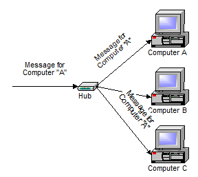
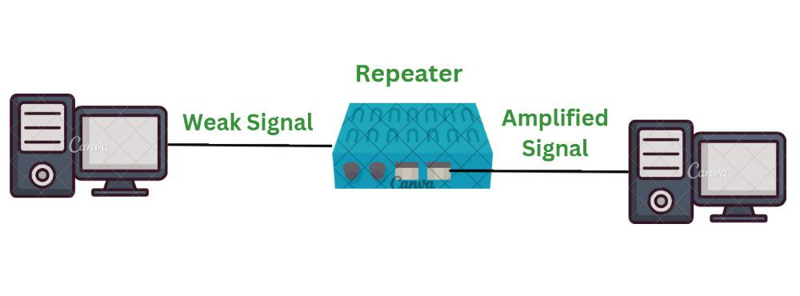

## HUB (Contenedor)

El **Hub** es un dispositivo simple con una única misión: **interconectar los ordenadores de una red local**.

### Funcionamiento de un Hub

Su funcionamiento es sencillo:

- Cuando alguno de los ordenadores de la red local que están conectados a él le envía datos, el **Hub los replica y transmite instantáneamente** al resto de ordenadores de esta red local.
- Es un **punto central de conexión** de una red y suele utilizarse para crear **redes locales** en las que los ordenadores solo se conectan entre sí.
- **No permite conectarse a Internet** por sí solo.
- **No permite direccionamiento selectivo**, ya que copia los datos que recibe y los envía a toda la red por igual.

### Desventajas del Hub

A pesar de su simplicidad, los Hubs presentan algunos inconvenientes:

- **Gasto de ancho de banda**: No permite enviar datos a un único ordenador sin replicarlos al resto.
- **Colisiones de datos**: Mientras se realiza una transmisión, **ningún otro equipo puede enviar datos** hasta que la transmisión termine.

## Repetidor

El **Repetidor** es un dispositivo electrónico que **conecta dos segmentos de una misma red**, transfiriendo el tráfico de uno a otro extremo, ya sea por **cable o inalámbrico**.

### Funcionamiento de un Repetidor

- Los segmentos de red son **limitados en su longitud**. En el caso de cable, generalmente **no superan los 100 metros**, debido a la pérdida de señal y la generación de ruido en las líneas.
- Un **Repetidor** evita este problema al **reconstruir la señal**, eliminando los ruidos y transmitiéndola de un segmento al otro.

### Uso en Redes Inalámbricas

- Actualmente, los **Repetidores** son muy populares en redes **inalámbricas o WiFi**.
- Un **Repetidor WiFi** amplifica la señal de la red **LAN inalámbrica** desde el **router** hasta el **ordenador u otro dispositivo**.
- Opera en la **capa 1 (física) del modelo OSI**, lo que significa que solo **retransmite** la señal sin analizar su contenido.

- 

## Router

El **Router** se encarga de **reenviar paquetes de datos** entre distintas redes, por lo general una **red local (LAN)** y una **red externa (WAN)**, como la conexión a Internet.

### Funcionamiento de un Router

- Los routers incluyen un **Switch (o Hub)** de entre 4 y 8 puertos **Ethernet** para conectar varios dispositivos.
- Su función principal es **enrutar los paquetes** de información entre redes, asegurando que lleguen a su destino.
- Permite la conexión a **Internet** y la interconexión de **redes locales** con otras redes externas.

### Características Adicionales

Los **routers modernos** incluyen:

- **Firewall basado en hardware** para proteger la red de ataques **DDoS** y otras amenazas.
- **Funciones avanzadas de gestión de tráfico**, como **QoS (Quality of Service)**.
- **Conectividad inalámbrica (WiFi)** integrada.

El **nombre "Router"** proviene de su función de **enrutar** los paquetes de datos de una red a otra para llevarlos a su destino final.

