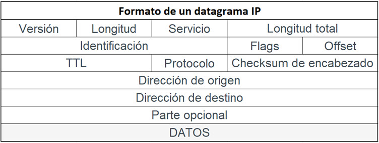

### Estructura de los Paquetes TCP/IP

Cada paquete TCP/IP tiene una estructura básica compuesta por encabezados (*headers*).

El encabezado IP actúa como la columna vertebral, proporcionando las direcciones de origen y destino, así como información sobre cómo debe ser manejado el paquete en la red. Este encabezado es crucial para los routers, ya que les permite tomar decisiones basadas en la información contenida en él.

Dentro del encabezado IP, encontramos el encabezado TCP, que contiene detalles como los puertos de origen y destino, el número de secuencia y la suma de verificación hash. Esta última es esencial para verificar la integridad del paquete. Por ejemplo, los investigadores de seguridad vigilan estos encabezados en busca de anomalías que podrían indicar ataques como el escaneo de puertos o intentos de inyección de datos.

Si consideramos que el encabezado es la columna vertebral, los datos y el *payload* representan el corazón de los paquetes TCP/IP. Aquí es donde se almacena la información valiosa que se transmite a través de la red.

Los *flags* de TCP indican los cambios de situación o condición que deben tener los *peers* entre ellos en su comunicación extremo a extremo.

En la formación clásica de TCP nos encontramos con seis *flags* principales:

- **SYN**
- **ACK**
- **FIN**
- **RST**
- **PSH**
- **URG**

